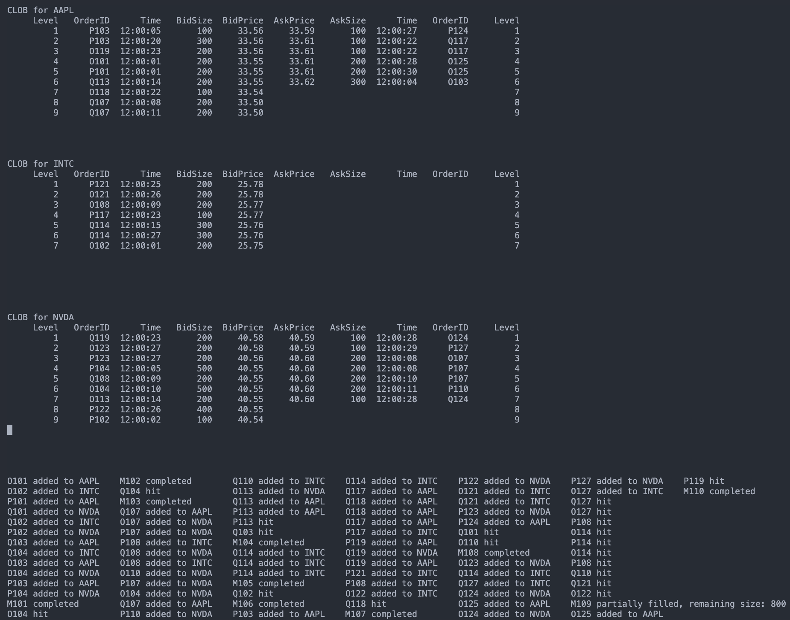

# Central Limit Order Book Simulation

Constraints:

- Only 3 stocks monitored
- Only 3 users interacting with the market
- No UI/UX
- To view complete simulation, ensure terminal/shell has at least 60 lines x 150 character width available. Failure will result in glitchy simulation
- Only serial version implemented, parallelism discussed in theory
- C++11 compatible
- ncurses should be supported in C++
- Monitored for only 30 seconds of market activity for easy tracking of results

## Data

User files have limit orders, Market file has market orders. The data in csv files has following columns:

1. Type
   1. Limit orders: Add, Cancel
   2. Market orders: Add (No cancellation as they happen immediately)
2. OrderID
3. Time (hh:mm:ss)
4. Symbol
5. Action
   1. Limit Orders: BUY or SELL, with bids and asks
   2. Market Orders: BUY or SELL, to interact with sell or buy limit orders
6. Size:
   1. Limit Orders: Bid/Ask size
   2. Market Orders: Trade size
7. Price:
   1. Limit Orders: Bid/Ask price
   2. Market Orders: Not required

## Data preparation

1. Run data_maker.ipynb to create user and market csv files, also a combined file for monitoring purposes.
2. combined file has orders arranged by stock symbol and time to track pertinent orders.

## Serial Simulation

1. compile with ``g++ -std=c++11 serial_clob.cpp -o clob_simulation -lncurses``
2. ensure terminal/shell has 60 lines and 150 character width for smooth viewing of simulation

Final output:

