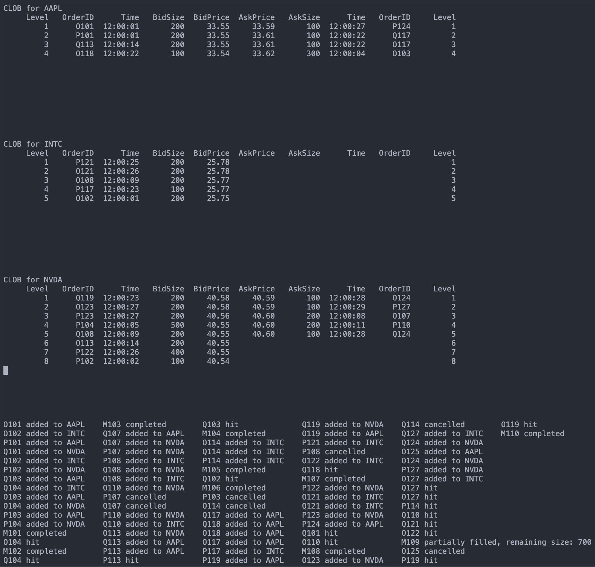

# Central Limit Order Book Simulation

Constraints:

- Only 3 stocks monitored
- Only 3 users interacting with the market
- No UI/UX
- To view complete simulation, ensure terminal/shell has at least 65 lines x 150 character width available. Failure will result in glitchy simulation
- Only serial version implemented, parallelism discussed in theory
- C++11 compatible
- ncurses should be supported in C++
- Monitored for only 30 seconds of market activity for easy tracking of results
- Data manufactured manually, no automation for more control over test cases

## Data

User files have limit orders, Market file has market orders. The data in csv files has following columns:

1. Type
   1. Limit orders: Add, Cancel
   2. Market orders: Add (No cancellation as they happen immediately)
2. OrderID
3. Time (hh:mm:ss)
4. Symbol
5. Action
   1. Limit Orders: BUY or SELL, with bids and asks
   2. Market Orders: BUY or SELL, to interact with sell or buy limit orders
6. Size:
   1. Limit Orders: Bid/Ask size
   2. Market Orders: Trade size
7. Price:
   1. Limit Orders: Bid/Ask price
   2. Market Orders: Not required

## Data preparation

1. Run ``data_maker.ipynb`` to create user and market csv files, also a combined file for monitoring purposes.
2. combined file has orders arranged by stock symbol and time to track pertinent orders.

## Serial Simulation

1. compile with ``g++ -std=c++11 serial_clob.cpp -o clob_simulation -lncurses``
2. ensure terminal/shell has 65 lines and 150 character width for smooth viewing of simulation

Final output:

## Example Tracking

1. M102: ``Add, M102, 12:00:06, NVDA, SELL, 500, None``, monitor ``overall.csv`` for NVDA,
   1. P102 gets added to buy side
   2. Q101 gets added to sell side
   3. O104 with better bid gets placed above P102
   4. P104 with same buy as O104 gets placed O104 by virtue of csv file reading order
   5. M102 wants to sell 500 shares, so O104 gets hit with M102 completed.
2. P103, O114 cancelled as scheduled
3. M101, M105 being small orders get completed without hitting any limit orders
4. M109 gets partially filled by depleting all INTC sell limit orders

## Methodology

First discussed are the data structures to provide foresight for the code used:

### Data Structures

1. Order: (custom) stores order attributes, overloaded operator for time-priority comparison
2. OrderCompare: (custom) overloaded as a function for comparison within buy or sell orders based on price-time priority
3. Map of multiset:
   1. The outer container is a map for orders of a particular stock symol, for efficiency
   2. The inner container is a multiset for efficient functions over new orders using OrderCompare. Multiset search is based on efficient data structure red-black trees.
   3. Multiset is better than set as it allows different orders with same price-time to be stored separately (from different users)
   4. Time complexities (n stock symbols => n multisets in map, m elements in multiset):
      1. Insertion: O(log(n) + log(m))
      2. Search: O(log(n) + log(m))
      3. Deletion: O(log(n) + log(m))
      4. Getting top order: O(log(n) + 1) = O(log n)
4. OrderComparator: (custom) overloaded as a function for prioritizing first read input order into priority queue
5. Priority Queue: To pop the topmost order from amongst time-sorted orders to simulate in real time

### Code

1. class CLOB has functions for limit order additions, limit order cancellations, processing market orders based on Order struct objects.
2. class CLOB function getCLOBstring generates output to be displayed in the terminal in real time to emulate a dynamic CLOB
3. There is a function to read csv files
4. There is a function to get code run's current timestamp
5. ncurses windows to allocate CLOBs and order execution outputs
6. orders are read from the priority queue as per their timestamp in real time, corresponding to a start time
7. The order is processed and CLOBs output is dynamically changed in real time
8. The thread sleeps for 0.1 second to emulate real-world processing delays and to be noticeable by human eye.
9. The code runs for 60 minutes so that the evaluator can patiently see the final status of all CLOBs and all print statements.

## Discussions

### Single-threaded vs Multi-threaded

1. For single-threaded execution, all tasks (data handling, order processing, UI updates) proceed linearly. This can cause delays as the system can only process one order at a time. For HFT levels, UI will suffer as the one thread is responsible for display updates.
   For multiple threads with main & worker sets approach, the next free worker thread can manage an individual user orders, and another free worker thread can manage different parts of the UI. Such parallelism will reduce latencies experienced by single-thread.
2. Multi-threaded approach will scale much better with multiple processors exploiting hardware to the maximum. New worker sets can be spawned dynamically for next incoming data.
3. Individual thread collpase will be fatal to single-threaded approach but can be contained in multi-threaded approach.

### Race conditions

A few examples:

1. Multiple threads attempting market orders on the same limit order, can lead to overwriting.
2. Separate threads attempting market order and cancellation on the same limit order, can lead to value errors or overwriting.
3. While UI thread is updating the CLOB changes, can lead to incorrect representation.
4. Multiple threads writing to the CLOB, can lead to overwriting.

Can be resolved by:

1. Locks and mutexes for synchronized access to the shared resources like CLOB. During modification by a single thread, the shared resources should block access to other threads.
2. Order queues maintained time-sorted by a dedicated thread (could be main thread) to be sequentially allocated to worker threads for synchronized processes.
3. State checks on data before and after operations.

### Edge Cases

1. Market order has no existing limit order to buy/sell from. It can either wait for a suitable limit order or be cancelled on the spot after a state check. I executed immediate cancellation.
2. Cancellation of an OrderID that does not exist. I implemented an iterator that will point to past-the-end of the multiset if a matching OrderID was not founf, and no cancellation will take place.

### Metrics

1. End-to-end latency from order creation to final execution confirmation.
2. Processing latency from order input to its effect reflected internally in the CLOB.
3. Update latency from update to the CLOB to its reflection on UI. Important to keep users updated.
4. Queue length: Shorter queue lengths in waiting implies a faster system.
5. System throughput: Number of Orders processed per second (or unit time). Higher throughput will scale better.

### Comments

1. CLOB structure based on the attached YouTube video.
2. Evaluator can make changes in the data_maker.ipynb or use custom datasets to test edge cases.
